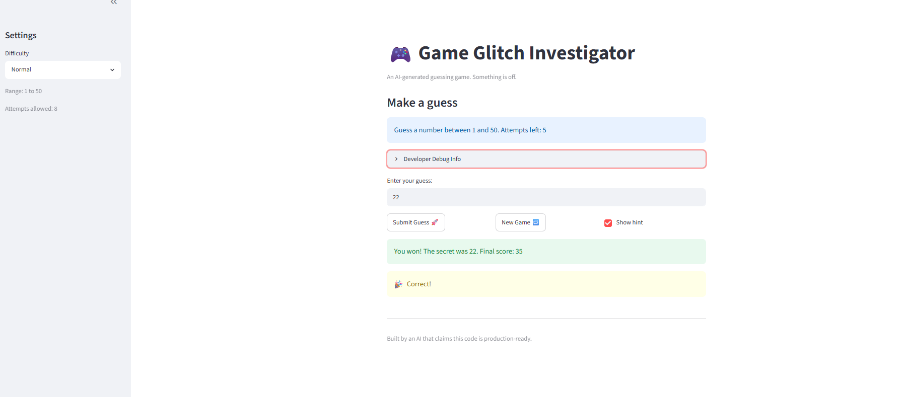

# 🎮 Game Glitch Investigator: The Impossible Guesser

## 🚨 The Situation

You asked an AI to build a simple "Number Guessing Game" using Streamlit.
It wrote the code, ran away, and now the game is unplayable. 

- You can't win.
- The hints lie to you.
- The secret number seems to have commitment issues.

## 🛠️ Setup

1. Install dependencies: `pip install -r requirements.txt`
2. Run the broken app: `python -m streamlit run app.py`

## 🕵️‍♂️ Your Mission

1. **Play the game.** Open the "Developer Debug Info" tab in the app to see the secret number. Try to win.
2. **Find the State Bug.** Why does the secret number change every time you click "Submit"? Ask ChatGPT: *"How do I keep a variable from resetting in Streamlit when I click a button?"*
3. **Fix the Logic.** The hints ("Higher/Lower") are wrong. Fix them.
4. **Refactor & Test.** - Move the logic into `logic_utils.py`.
   - Run `pytest` in your terminal.
   - Keep fixing until all tests pass!

## 📝 Document Your Experience

- [ ] Describe the game's purpose.
      This game challenges players to guess a randomly generated secret number within a limited number of attempts. After each guess, the game provides higher-or-lower hints to help players find the correct answer before running out of chances.

- [ ] Detail which bugs you found.
      1. The difficulty settings were reversed. The **Easy** level was more challenging than the **Hard** level, which caused confusion for users.

      2. The game did not properly validate user input. Non-numeric values and out-of-range numbers were accepted instead of being rejected with an error message.

      3. After completing a game and starting a new one, the **Submit Guess** button became unresponsive and no longer processed guesses.

      4. The hint system provided incorrect guidance. In some cases, the game instructed the player to guess higher when the correct response should have been lower, or vice versa.

      5. The number of attempts was inconsistent in **Normal** difficulty. The initial game started with 7 attempts, but selecting **New Game** reset the game with 8 attempts instead.

- [ ] Explain what fixes you applied.
      ### Fixes Applied

      1. Corrected the difficulty settings so that **Easy**, **Normal**, and **Hard** use the intended number range and attempt limits.

      2. Added input validation to reject non-numeric and out-of-range values without consuming an attempt.

      3. Reset the game state properly when **New Game** is selected, ensuring the **Submit Guess** button remains functional.

      4. Fixed the hint logic so that the game correctly displays **"Go HIGHER!"** or **"Go LOWER!"** based on the player's guess.

      5. Standardized the attempt count initialization so that **Normal** difficulty consistently starts with the same number of attempts, including after a game reset.


## 📸 Demo Walkthrough

Instead of a screenshot, here is a textual walkthrough that steps through a sample game in order. (Difficulty: **Normal** — range 1–50, 8 attempts. For this run the secret number is **37**, visible in the "Developer Debug Info" expander.)

1. The app loads on **Normal** difficulty and displays the prompt: *"Guess a number between 1 and 50. Attempts left: 8."*

2. The user enters **20** and clicks **Submit Guess**. The game displays **"Go HIGHER!"** because 20 is lower than the secret number (**31**). The remaining attempts decrease to **7**, and the hint remains visible on the screen.

3. The user enters **45** and submits the guess. The game displays **"Go LOWER!"** because 45 is higher than the secret number (**31**). The remaining attempts decrease to **6**, and the Debug Info history updates to **[20, 45]**.

4. The user enters **xyz**. The game displays *"That is not a number."* and does not deduct an attempt. The remaining attempts stay at **6**. An out-of-range value such as **75** is also rejected without consuming an attempt.

5. The user enters **31** and submits the guess. The game displays balloons and the message *"You won! The secret was 31."* The score updates correctly, the game status changes to **won**, and further submissions are disabled. Clicking **New Game** resets the secret number, attempts, score, and guess history for a new game.


**Screenshot** *(optional)*: <!-- Insert a screenshot of your fixed, winning game here -->



## 🧪 Test Results

```
# Paste your pytest output here, e.g.:
# pytest tests/
# ========================= X passed in 0.XXs =========================
```
## Test Results

```text
test/test_game_logic.py::TestDifficultyLevel::test_known_difficulties[Easy-expected0] PASSED                                                                                                       [  3%]
test/test_game_logic.py::TestDifficultyLevel::test_known_difficulties[Normal-expected1] PASSED                                                                                                     [  6%]
test/test_game_logic.py::TestDifficultyLevel::test_known_difficulties[Hard-expected2] PASSED                                                                                                       [ 10%]
test/test_game_logic.py::TestDifficultyLevel::test_range_widens_with_difficulty PASSED                                                                                                             [ 13%]
test/test_game_logic.py::TestDifficultyLevel::test_unknown_difficulty_has_default PASSED                                                                                                           [ 16%]
test/test_game_logic.py::TestInputValidation::test_empty_input_is_rejected[None] PASSED                                                                                                            [ 20%]
test/test_game_logic.py::TestInputValidation::test_empty_input_is_rejected[] PASSED                                                                                                                [ 23%]
test/test_game_logic.py::TestInputValidation::test_non_numeric_input_is_rejected[abc] PASSED                                                                                                       [ 26%]
test/test_game_logic.py::TestInputValidation::test_non_numeric_input_is_rejected[12a] PASSED                                                                                                       [ 30%]
test/test_game_logic.py::TestInputValidation::test_non_numeric_input_is_rejected[ten] PASSED                                                                                                       [ 33%]
test/test_game_logic.py::TestInputValidation::test_non_numeric_input_is_rejected[ ] PASSED                                                                                                         [ 36%]
test/test_game_logic.py::TestInputValidation::test_valid_integer_is_parsed PASSED                                                                                                                  [ 40%]
test/test_game_logic.py::TestInputValidation::test_float_string_is_truncated_to_int PASSED                                                                                                         [ 43%]
test/test_game_logic.py::TestInputValidation::test_out_of_range_guess_is_rejected[0] PASSED                                                                                                        [ 46%]
test/test_game_logic.py::TestInputValidation::test_out_of_range_guess_is_rejected[21] PASSED                                                                                                       [ 50%]
test/test_game_logic.py::TestInputValidation::test_out_of_range_guess_is_rejected[100] PASSED                                                                                                      [ 53%]
test/test_game_logic.py::TestInputValidation::test_range_boundaries_are_inclusive[1] PASSED                                                                                                        [ 56%]
test/test_game_logic.py::TestInputValidation::test_range_boundaries_are_inclusive[20] PASSED                                                                                                       [ 60%]
test/test_game_logic.py::TestInputValidation::test_no_range_means_no_range_check PASSED                                                                                                            [ 63%]
test/test_game_logic.py::TestAccurateHints::test_correct_guess_wins PASSED                                                                                                                         [ 66%]
test/test_game_logic.py::TestAccurateHints::test_too_high_points_lower PASSED                                                                                                                      [ 70%]
test/test_game_logic.py::TestAccurateHints::test_too_low_points_higher PASSED                                                                                                                      [ 73%]
test/test_game_logic.py::TestAccurateHints::test_string_secret_is_compared_numerically PASSED                                                                                                      [ 76%]
test/test_game_logic.py::TestCorrectAttempts::test_winning_sooner_scores_more PASSED                                                                                                               [ 80%]
test/test_game_logic.py::TestCorrectAttempts::test_win_score_has_a_floor PASSED                                                                                                                    [ 83%]
test/test_game_logic.py::TestCorrectAttempts::test_wrong_low_guess_loses_points PASSED                                                                                                             [ 86%]
test/test_game_logic.py::TestCorrectAttempts::test_unknown_outcome_leaves_score_unchanged PASSED                                                                                                   [ 90%]
tests/test_game_logic.py::test_winning_guess PASSED                                                                                                                                                [ 93%]
tests/test_game_logic.py::test_guess_too_high PASSED                                                                                                                                               [ 96%]
tests/test_game_logic.py::test_guess_too_low PASSED                                                                                                                                                [100%]

==========================================================================================
30 passed in 0.07s
==========================================================================================
```

## 🚀 Stretch Features

- [ ] [If you choose to complete Challenge 4, describe the Enhanced UI changes here — a screenshot is optional]


Challenge 1: Advanced Edge-Case Testing
```test
test/test_game_logic.py::TestEdgeCases::test_negative_numbers_are_rejected[-5] PASSED                                                                                                     [ 71%]
test/test_game_logic.py::TestEdgeCases::test_negative_numbers_are_rejected[-1] PASSED                                                                                                     [ 74%]
test/test_game_logic.py::TestEdgeCases::test_negative_numbers_are_rejected[-100] PASSED                                                                                                   [ 76%]
test/test_game_logic.py::TestEdgeCases::test_negative_numbers_are_rejected[-3.9] PASSED                                                                                                   [ 79%]
test/test_game_logic.py::TestEdgeCases::test_extremely_large_number_does_not_crash PASSED                                                                                                 [ 82%]
test/test_game_logic.py::TestEdgeCases::test_tricky_decimal_and_special_floats[.5-Enter a number between 1 and 20.] PASSED                                                                [ 84%]
test/test_game_logic.py::TestEdgeCases::test_tricky_decimal_and_special_floats[1e2-That is not a number.] PASSED                                                                          [ 87%]
test/test_game_logic.py::TestEdgeCases::test_tricky_decimal_and_special_floats[inf-That is not a number.] PASSED                                                                          [ 89%]
test/test_game_logic.py::TestEdgeCases::test_tricky_decimal_and_special_floats[nan-That is not a number.] PASSED                                                                          [ 92%]
tests/test_game_logic.py::test_winning_guess PASSED                                                                                                                                       [ 94%]
tests/test_game_logic.py::test_guess_too_high PASSED                                                                                                                                      [ 97%]
tests/test_game_logic.py::test_guess_too_low PASSED                                                                                                                                       [100%]

====================================================================================== 39 passed in 0.08s ======================================================================================
```